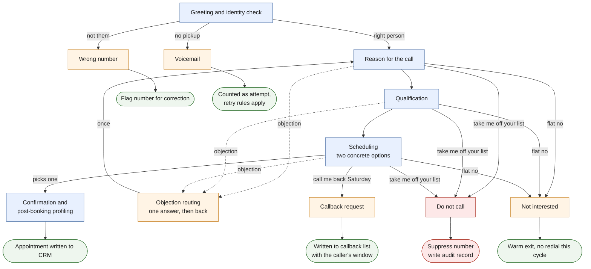

# The outbound booking flow

The outbound agent runs a 13-node conversation flow. Nodes are states, not
script lines. The agent talks naturally inside each node and the flow decides
what it's allowed to do next. This doc describes the anatomy, not the exact
prompts, which stay private.

Blue is the spine, the path a willing caller takes. Orange is the branches.
Red is the one branch that's a legal obligation, not a preference. Every exit
on the right writes something back to the CRM.

## The spine

The happy path is short on purpose. Five states get a willing caller from
hello to a confirmed appointment in about two minutes.

**Greeting and identity confirmation.** Confirm you're talking to the person
the record says you are. Everything downstream depends on this, because a
wrong-number conversation and a right-number conversation must never be
handled the same way.

**Reason for the call.** The incentive the contact originally signed up for,
stated plainly. No pretending this is a survey. People can tell.

**Qualification.** A couple of questions that decide whether an appointment
makes sense and prepare the rep who'll run it.

**Scheduling.** Alternate-choice close: two concrete options instead of an
open-ended "when works for you." Decades of sales floors have proven this
one out, and it turns out to work exactly the same when software asks.

**Confirmation and post-booking profiling.** Read the appointment back, then
gather the details that make the visit go well. Household questions, who
needs to be present. The rep walks in prepared instead of cold.

## The branches

The branches are where the production time went. Every one of these exits the
spine into its own state with its own rules.

**Do not call.** The moment the intent appears, the agent stops selling,
confirms the removal out loud, and ends the call politely. The number is
suppressed and an audit record is written. Details in
[compliance-design.md](compliance-design.md).

**Wrong number.** Apologize, end the call, flag the number so it's corrected
in the database and never redialed for this contact. This is also where a
surprising amount of list cleaning happens for free.

**Not interested.** A clean, warm exit. No second push. An aged list is full
of people who will say no this year and yes in two years, and the exit
determines which kind of no it was.

**Callback request.** Capture the day and window in the caller's own terms,
confirm it back, and write it to the callback list the team works daily.

**Voicemail.** Short message, incentive named, callback number left. Counted
as an attempt so retry logic stays honest.

**Objection routing.** The recoverable objections, "how long does this
take," "is this a sales thing," get one honest answer and one return to the
spine. One. An agent that argues is worse than an agent that hangs up.

## Why a flow and not one big prompt

One prompt holding all of these behaviors at once does the average of them.
The flow makes the current state's job small and checkable: in the DNC state
there is nothing to decide except confirming and exiting, so it cannot
freelance. Small jobs are also testable jobs. You can point calls at any
state and verify behavior without hoping the model finds its way there.

## After the call

Every call produces structured notes through a post-call analysis pass on a
smaller model: disposition, appointment details if any, callback window if
any, flags for review. The recording stops being the record. The notes are
the record, and they're what syncs to the team's sheets and gets entered
into the CRM.
